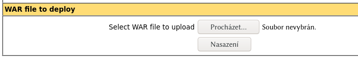

# Docker & Tomcat

Run from the command line:

```
docker run -it --rm --name tomcat -p 8080:8080 ghcr.io/fidransky/tomcat:10-jdk17-temurin
```

To access the manager application, go to [http://localhost:8080/manager/html](http://localhost:8080/manager/html).

Log in using `admin` as both username and password.

Here, you can deploy your own web application using the **WAR file to deploy** section:


